---
---

# Vliegmachien!

Ons idee is simpel: __Vliegmachien!__ fietst over het festival en verzorgt tot in de verre uithoeken van het terrein popup-optredens. We zijn uitgerust met een PA, hangend onder de vleugels, en in 't ruim vervoeren we een gitaarversterker. En, uiteraard, overal lampjes en lichtjes, voor als het donker is. Samen met de bands die optreden op het festival ontstaat er een randprogrammering van kleine, semi-akoestische optredens, op willekeurige plekken.

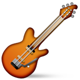
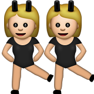
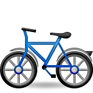

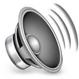

#### Foto's

In het begin - onderweg van Rotterdam naar Utrecht:

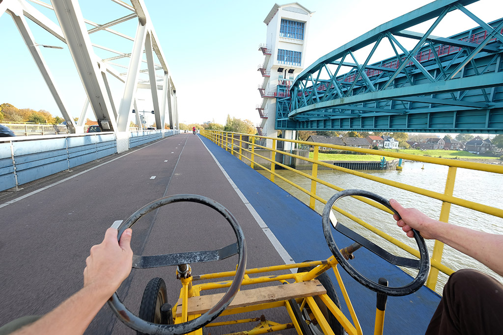

Werkplaats in Utrecht, met __Vliegmachien!__ in z'n huidige staat:

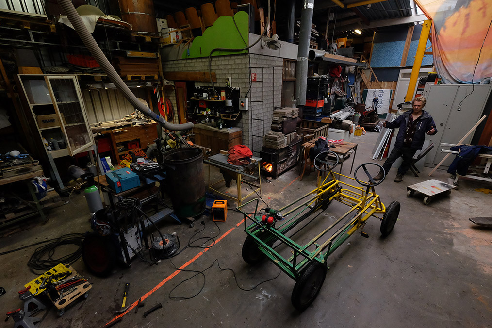

#### Begroting

| Omschrijving            | Kosten
|:------------------------|-----------:
| Fietsskelter            |    € 200,-
| Staal, hout, verf, etc. |    € 300,-
| Lampjes!                |    € 100,-
| Accu's                  |    € 100,-
| Geluidsinstallatie      |    € 550,-
| Gitaarversterker        |    € 200,-
| __Totaal__              | __€ 1450,-__

#### Portfolio

Mobiele hottub (kan eenvoudig aan de trekhaak!):

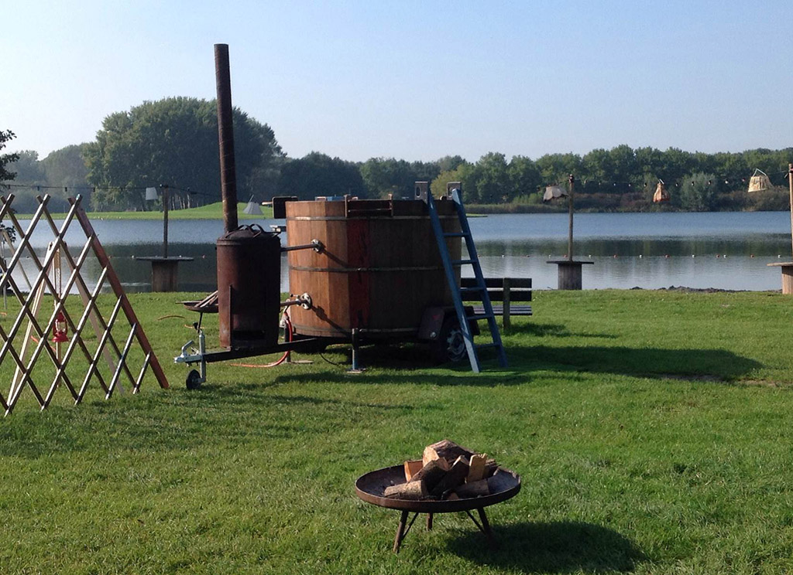

Houtblokmuur, in café Bar Lot:

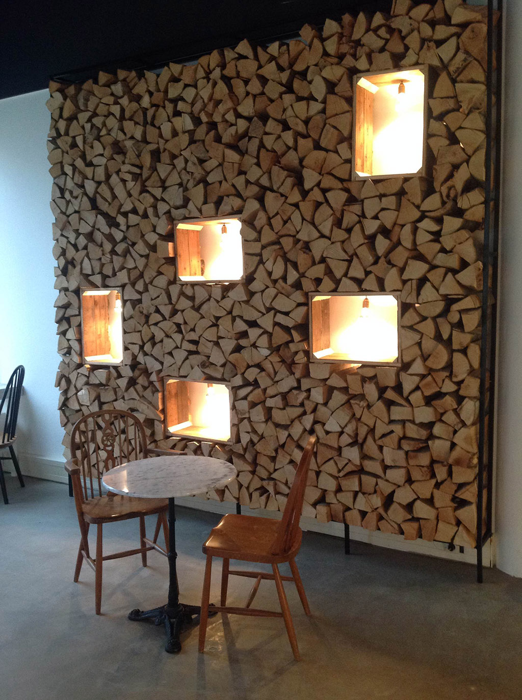

Mobiele yoert:

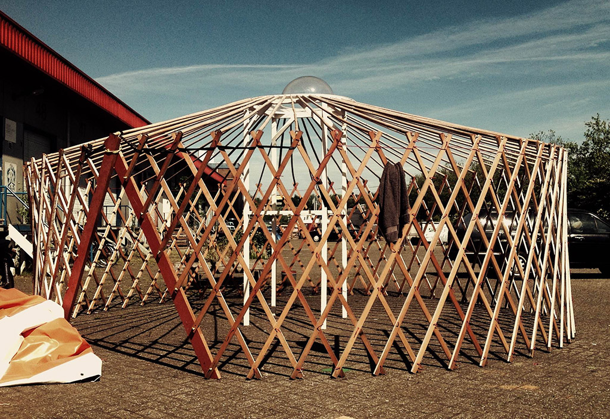

Piepermobiel, mobiele kraam voor biologische friet:

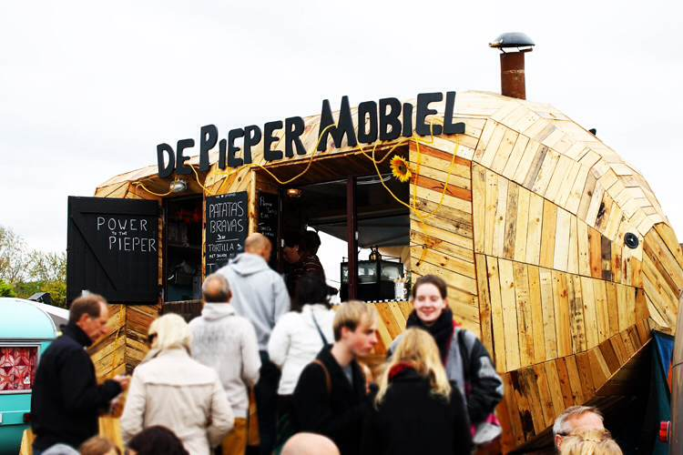

Saunakaravaan, festival in Amsterdam:

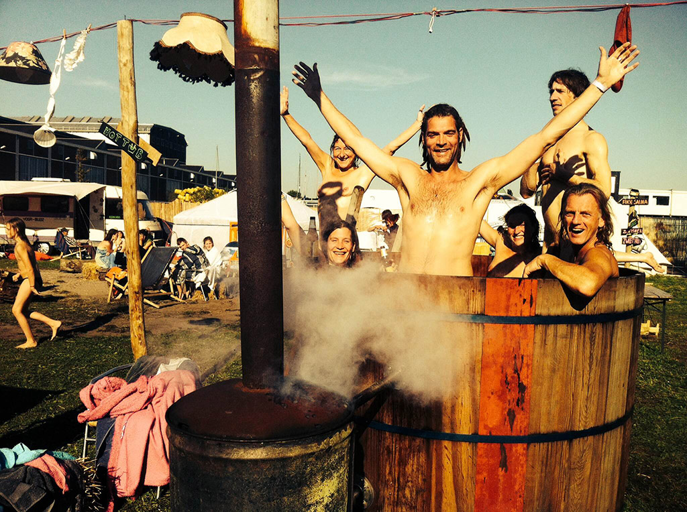

Stoomhut:

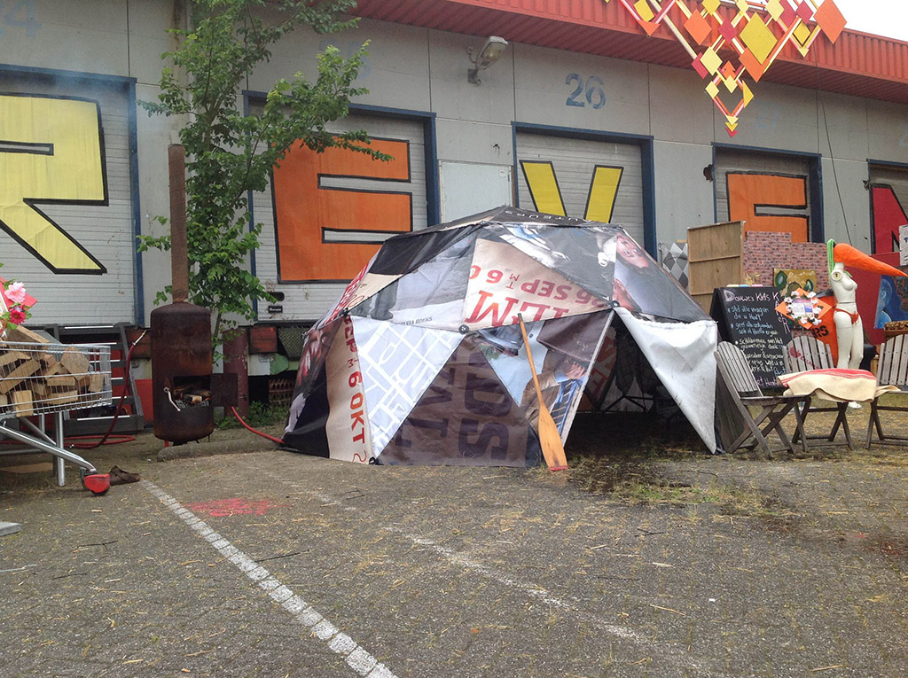

Hottub, gemaakt van onderstel van varkensvoedersilo:

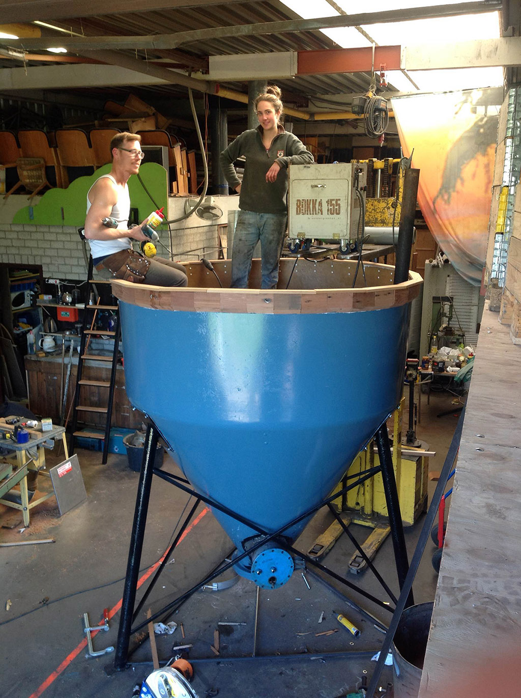

Allereerste schets van __Vliegmachien!__:

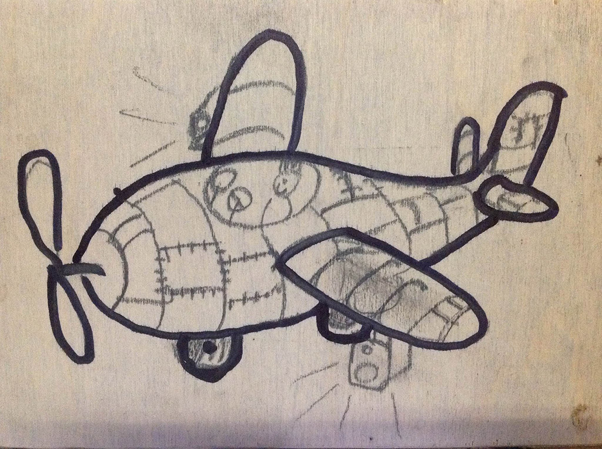

#### CV

__Casper van Oort__ is zelfstandig meubelmaker en conceptrealisator te Utrecht. Casper kan alles maken, en doet dat ook. Ook is Casper mede-eigenaar van een karavaan zelfgebouwde mobiele hottubs, sauna's en stoomhutten, waarmee hij in de zomer (en in de winter) op festivals staat.

- [saunabokkies.nl](http://www.saunabokkies.nl/)
- [facebook.com/saunabokkies](https://www.facebook.com/saunabokkies)

__Bert Spaan__ is softwareontwikkelaar en cartograaf, en werkzaam bij Waag Society in Amsterdam, een onafhankelijk onderzoeksinstituut voor nieuwe media, technologie en cultuur. En, als hij de kans krijgt, knutselt hij en bouwt hij fietsskelters om tot rijdende vliegtuigpodia.

- [Landkaart met alle 9,866,539 gebouwen in Nederland](http://code.waag.org/buildings/)
- [Maptime Amsterdam](http://maptime-ams.github.io/)
